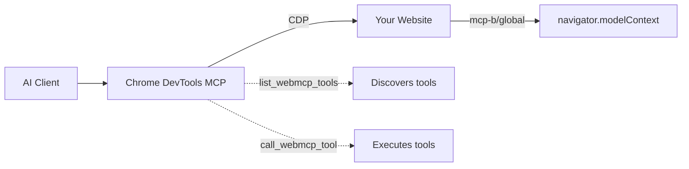
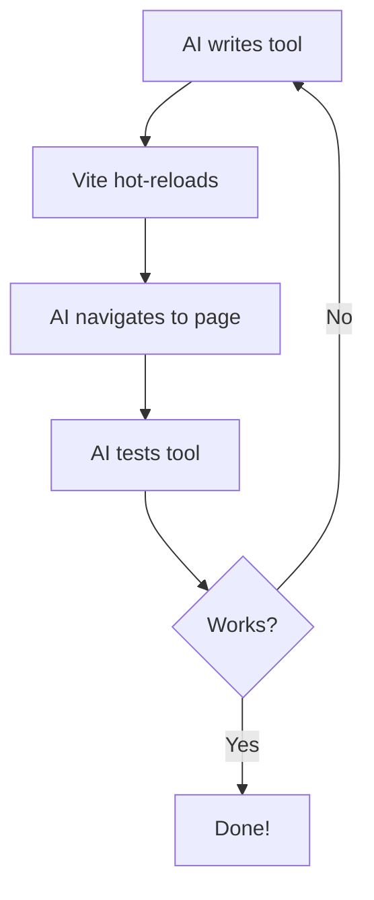

# Chrome DevTools MCP Quickstart

## Motivation
[Chrome DevTools MCP](https://github.com/ChromeDevTools/chrome-devtools-mcp/) allows coding agents to debug tools — DOM inspection, console logs, network requests, and performance insights. 

This approach empowres the agent-driven development of [WebMCP](https://github.com/MiguelsPizza/WebMCP) by dramatically reducing the token consumption, in comparison to the previous screen-shot approach.

> [!NOTE]
> What is WebMCP?   
> WebMCP is a new MCP protocol which allows any website to be callable by AI Agents. Technically, WebMCP is a way to embed MCP serviers in websites, expose javascript functionalities to MCP cleints as MCP tools.   
> Recntly the protocol became [an official W3C web standard✨](https://github.com/webmachinelearning/webmcp).

> [!NOTE]
> We have [✨ Playground](https://meetchar.ai). Feel free to try! 🤗   
> If you have any questions or suggesitons, please reach out to us: [MigglesPizza](https://github.com/MiguelsPizza) & [Zkitty](https://x.com/n0rizkitty)


> Let AI agents interact with your website through Chrome DevTools Protocol + WebMCP tools.

**Up to 89% fewer tokens** compared to screenshot-based workflows. [→ See detailed benchmarks](#token-usage-benchmarks)


**What this does:** AI agents (Claude Code, Cursor, etc.) can navigate to your website, discover your tools via `list_webmcp_tools`, and call them via `call_webmcp_tool`.

## Quick Start (3 Steps)

### 1. Clone & Run

```bash
git clone https://github.com/WebMCP-org/chrome-devtools-quickstart.git
cd chrome-devtools-quickstart
npm install && npm run dev
```

### 2. Add MCP Server to Your AI Client

**Claude Code:**
```bash
claude mcp add chrome-devtools npx @mcp-b/chrome-devtools-mcp@latest
```

**Optional:** Add the [WebMCP docs server](https://docs.mcp-b.ai/mcp-integration) so your AI knows how to build tools:
```bash
claude mcp add --transport http webmcp-docs https://docs.mcp-b.ai/mcp
```

<details>
<summary>Cursor, Claude Desktop, Windsurf, Other Clients</summary>

**Cursor** - Add to `.cursor/mcp.json`:
```json
{
  "mcpServers": {
    "chrome-devtools": {
      "command": "npx",
      "args": ["@mcp-b/chrome-devtools-mcp@latest"]
    },
    "webmcp-docs": {
      "url": "https://docs.mcp-b.ai/mcp"
    }
  }
}
```

**Claude Desktop** - Edit `~/Library/Application Support/Claude/claude_desktop_config.json` (macOS):
```json
{
  "mcpServers": {
    "chrome-devtools": {
      "command": "npx",
      "args": ["@mcp-b/chrome-devtools-mcp@latest"]
    },
    "webmcp-docs": {
      "url": "https://docs.mcp-b.ai/mcp"
    }
  }
}
```

**Windsurf** - Add to `mcp_config.json`:
```json
{
  "mcpServers": {
    "chrome-devtools": {
      "command": "npx",
      "args": ["@mcp-b/chrome-devtools-mcp@latest"]
    },
    "webmcp-docs": {
      "command": "npx",
      "args": ["mcp-remote", "https://docs.mcp-b.ai/mcp"]
    }
  }
}
```

</details>

### 3. Test It

Ask your AI:

> "Navigate to http://localhost:5173, list available WebMCP tools, and set the counter to 42"

The AI will navigate to your page, discover the tools, and execute them:


---

## How It Works



1. Your website loads [`@mcp-b/global`](https://www.npmjs.com/package/@mcp-b/global) which adds `navigator.modelContext`
2. You register tools using `navigator.modelContext.registerTool()`
3. [Chrome DevTools MCP](https://docs.mcp-b.ai/packages/chrome-devtools-mcp) connects to Chrome and exposes `list_webmcp_tools` + `call_webmcp_tool`
4. AI agents discover and call your tools

**To use in your own project:**
```bash
npm install @mcp-b/global
```
Then import it before registering tools (see examples below).

---

## Example Tools (in this repo)

This quickstart includes 3 example tools in [`counter.js`](./counter.js):

| Tool | Description |
|------|-------------|
| `get_page_title` | Returns `document.title` |
| `get_counter` | Returns current counter value |
| `set_counter` | Sets counter to specified value |

### Registering a Tool

```javascript
import '@mcp-b/global';  // Must be first!

navigator.modelContext.registerTool({
  name: "get_counter",
  description: "Returns the current counter value",
  inputSchema: { type: "object", properties: {} },
  async execute() {
    return {
      content: [{ type: "text", text: `Counter is ${counter}` }]
    };
  }
});
```

### Tool with Parameters

```javascript
navigator.modelContext.registerTool({
  name: "set_counter",
  description: "Sets the counter to the desired value",
  inputSchema: {
    type: "object",
    properties: {
      newCounterValue: {
        type: "number",
        description: "The number to set the counter to"
      }
    },
    required: ["newCounterValue"]
  },
  async execute(args) {
    setCounter(args.newCounterValue);
    return {
      content: [{ type: "text", text: `Counter is now ${args.newCounterValue}` }]
    };
  }
});
```

---

## AI Development Loop

The real power: AI can write tools, test them, and iterate—all in one session.



**Try it:**
> "Create a WebMCP tool called 'toggle_theme' that switches between light and dark mode. Add it to counter.js, then test it."

---

## Available Tools

Chrome DevTools MCP includes 28+ browser automation tools:

| Category | Tools |
|----------|-------|
| **Navigation** | `navigate_page`, `go_back`, `go_forward`, `refresh` |
| **Interaction** | `click`, `fill`, `hover`, `press_key`, `drag` |
| **Inspection** | `take_screenshot`, `take_snapshot`, `evaluate_script` |
| **Tabs** | `list_pages`, `select_page`, `new_page`, `close_page` |
| **WebMCP** | `list_webmcp_tools`, `call_webmcp_tool` |

---

## Other Ways to Call WebMCP Tools

Besides Chrome DevTools MCP, you can call WebMCP tools directly from the browser:

| Option | Description | Link |
|--------|-------------|------|
| **MCP-B Extension** | Browser extension that collects tools from all open tabs | [Chrome Web Store](https://chromewebstore.google.com/detail/mcp-b-extension/daohopfhkdelnpemnhlekblnikhdhfa) |
| **Embedded Agent** | Drop-in AI assistant for your website | [Docs](https://docs.mcp-b.ai/calling-tools/embedded-agent) |

---

## Token Usage Benchmarks

WebMCP tools use **up to 89% fewer tokens** than screenshot-based approaches. We measured real Claude API token usage for identical tasks:


### Simple Task: Set Counter to 42

| Approach | Total Tokens | Screenshots | Cost |
|----------|--------------|-------------|------|
| Screenshot-based | 3,801 | 2 | $0.015 |
| **WebMCP tools** | **433** | 0 | $0.003 |
| **Reduction** | **89%** | - | **83%** |

### Complex Task: Create Calendar Event (Multi-step)

| Approach | Total Tokens | Screenshots | WebMCP Calls | Cost |
|----------|--------------|-------------|--------------|------|
| Screenshot-based | 11,390 | 4 | 0 | $0.048 |
| **WebMCP tools** | **2,583** | 0 | 6 | $0.012 |
| **Reduction** | **77%** | - | - | **76%** |

### Why WebMCP is More Efficient

- **Screenshots are expensive**: Each image costs ~2,000 tokens at 1512x982 viewport (calculated as `width × height / 750`)
- **Tool responses are compact**: JSON responses typically use 20-100 tokens
- **No verification screenshots needed**: Tool responses confirm success directly
- **Simple tasks benefit most**: Direct tool access eliminates visual parsing overhead

### Run the Benchmarks Yourself

```bash
# Add your API key to .env
echo "ANTHROPIC_API_KEY=your-key" > .env

# Install dependencies
npm install

# Run simple benchmark (counter app - starts dev server automatically)
npm run benchmark:simple:direct

# Run complex benchmark (calendar app - uses live deployment)
npm run benchmark:complex:direct
```

---

## Troubleshooting

| Problem | Solution |
|---------|----------|
| `navigator.modelContext is undefined` | Import `@mcp-b/global` before registering tools |
| No tools found | Wait for page to fully load, check browser console |
| Can't connect to Chrome | Ensure Chrome is running, check firewall settings |

---

## Resources

| Resource | Link |
|----------|------|
| WebMCP Docs | https://docs.mcp-b.ai |
| Chrome DevTools MCP | https://docs.mcp-b.ai/packages/chrome-devtools-mcp |
| @mcp-b/global | https://www.npmjs.com/package/@mcp-b/global |
| MCP-B Extension | [Chrome Web Store](https://chromewebstore.google.com/detail/mcp-b-extension/daohopfhkdelnpemnhlekblnikhdhfa) |
| Examples | https://github.com/WebMCP-org/examples |
| Live Demo | https://webmcp.sh |
| Discord | https://discord.gg/ZnHG4csJRB |
| GitHub | https://github.com/WebMCP-org |

---

## Credits

This quickstart uses [@mcp-b/chrome-devtools-mcp](https://www.npmjs.com/package/@mcp-b/chrome-devtools-mcp), a fork of [ChromeDevTools/chrome-devtools-mcp](https://github.com/ChromeDevTools/chrome-devtools-mcp) by Google LLC and the ChromeDevTools team. The fork adds WebMCP integration for connecting to website-registered MCP tools.

- **npm package**: [@mcp-b/chrome-devtools-mcp](https://www.npmjs.com/package/@mcp-b/chrome-devtools-mcp)
- **Source**: [WebMCP-org/npm-packages](https://github.com/WebMCP-org/npm-packages)

---

## License

MIT
