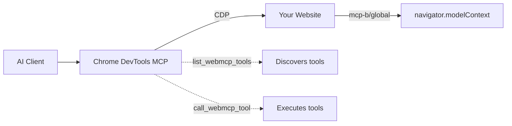
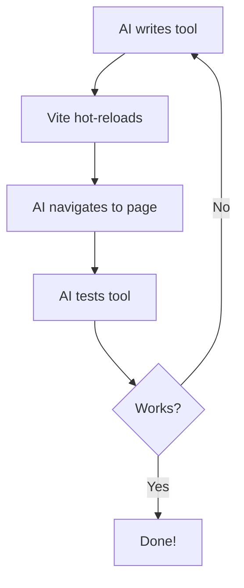

# Chrome DevTools MCP Quickstart
> Give AI agents direct access to your website's functionality—no screenshots, no DOM scraping, just structured tool calls.

> [!NOTE]
> What is WebMCP?
> 
> 
> 
> WebMCP is a new MCP protocol that makes any website executable by AI Agents. Technically, WebMCP embeds MCP servers in websites, exposing JavaScript functionalities to MCP clients as MCP tools.   
> Recntly the protocol became [an official W3C web standard✨](https://github.com/webmachinelearning/webmcp).
> 
> We have [✨ Playground](https://meetchar.ai). Feel free to try! 🤗   
> If you have any questions or suggesitons, [MiguelsPizza](https://github.com/MiguelsPizza) & [Zkitty](https://x.com/n0rizkitty)

[](https://discord.gg/a9fBR6Bw)


## Why This Matters
**Up to 89% fewer tokens** compared to screenshot-based workflows.


## How It Works




1. Your website loads [`@mcp-b/global`](https://www.npmjs.com/package/@mcp-b/global) which adds `navigator.modelContext`
2. You register tools using `navigator.modelContext.registerTool()`
3. [Chrome DevTools MCP](https://docs.mcp-b.ai/packages/chrome-devtools-mcp) connects to Chrome and exposes `list_webmcp_tools` + `call_webmcp_tool`
4. AI agents discover and call your tools

---

## Quick Start (3 Steps)

### 1. Clone & Run

```bash
git clone https://github.com/WebMCP-org/chrome-devtools-quickstart.git
cd chrome-devtools-quickstart
npm install && npm run dev
```

### 2. Add MCP Server to Your AI Client

**Claude Code:**
```bash
claude mcp add chrome-devtools npx @mcp-b/chrome-devtools-mcp@latest
```

**Optional:** Add the [WebMCP docs server](https://docs.mcp-b.ai/mcp-integration) so your AI knows how to build tools:
```bash
claude mcp add --transport http webmcp-docs https://docs.mcp-b.ai/mcp
```

<details>
<summary>Cursor, Claude Desktop, Windsurf, Other Clients</summary>

**Cursor** - Add to `.cursor/mcp.json`:
```json
{
  "mcpServers": {
    "chrome-devtools": {
      "command": "npx",
      "args": ["@mcp-b/chrome-devtools-mcp@latest"]
    },
    "webmcp-docs": {
      "url": "https://docs.mcp-b.ai/mcp"
    }
  }
}
```

**Claude Desktop** - Edit `~/Library/Application Support/Claude/claude_desktop_config.json` (macOS):
```json
{
  "mcpServers": {
    "chrome-devtools": {
      "command": "npx",
      "args": ["@mcp-b/chrome-devtools-mcp@latest"]
    },
    "webmcp-docs": {
      "url": "https://docs.mcp-b.ai/mcp"
    }
  }
}
```

**Windsurf** - Add to `mcp_config.json`:
```json
{
  "mcpServers": {
    "chrome-devtools": {
      "command": "npx",
      "args": ["@mcp-b/chrome-devtools-mcp@latest"]
    },
    "webmcp-docs": {
      "command": "npx",
      "args": ["mcp-remote", "https://docs.mcp-b.ai/mcp"]
    }
  }
}
```

</details>

### 3. Test It

Ask your AI:

> "Navigate to http://localhost:5173, list available WebMCP tools, and set the counter to 42"

The AI will navigate to your page, discover the tools, and execute them:


---

## Background

[Chrome DevTools MCP](https://github.com/ChromeDevTools/chrome-devtools-mcp/) is an MCP server that gives AI agents full browser automation capabilities—navigation, clicking, typing, screenshots, console access, network inspection, and performance profiling.

[WebMCP](https://github.com/MiguelsPizza/WebMCP) takes this further: instead of AI parsing screenshots or scraping DOM, your website exposes JavaScript functions as structured tools that AI can call directly. The result is faster, cheaper, and more reliable agent interactions.

> [!NOTE]
> **What is WebMCP?**
> WebMCP turns your website's JavaScript functions into AI-callable tools. Register a function once, and any MCP-compatible AI client can discover and invoke it—with type-safe parameters and structured responses. The protocol is being [standardized through the W3C Web Machine Learning Community Group](https://github.com/webmachinelearning/webmcp).

> [!NOTE]
> **Try it live:** Explore the [Playground](https://meetchar.ai) to see WebMCP in action.
> Questions? Reach out: [MiguelsPizza](https://github.com/MiguelsPizza) & [Zkitty](https://x.com/n0rizkitty)

---

## Example Tools

This quickstart includes 3 example tools in [`counter.js`](./counter.js):

| Tool | Description |
|------|-------------|
| `get_page_title` | Returns `document.title` |
| `get_counter` | Returns current counter value |
| `set_counter` | Sets counter to specified value |

### Registering a Tool

```javascript
import '@mcp-b/global';  // Must be first!

navigator.modelContext.registerTool({
  name: "get_counter",
  description: "Returns the current counter value",
  inputSchema: { type: "object", properties: {} },
  async execute() {
    return {
      content: [{ type: "text", text: `Counter is ${counter}` }]
    };
  }
});
```

### Tool with Parameters

```javascript
navigator.modelContext.registerTool({
  name: "set_counter",
  description: "Sets the counter to the desired value",
  inputSchema: {
    type: "object",
    properties: {
      newCounterValue: {
        type: "number",
        description: "The number to set the counter to"
      }
    },
    required: ["newCounterValue"]
  },
  async execute(args) {
    setCounter(args.newCounterValue);
    return {
      content: [{ type: "text", text: `Counter is now ${args.newCounterValue}` }]
    };
  }
});
```

**To use in your own project:**
```bash
npm install @mcp-b/global
```
Then import it before registering tools.

---

## AI Development Loop

The real power: AI writes code, hot-reloads, tests in the browser, and iterates—all without leaving your editor.



**Try it:**
> "Create a WebMCP tool called 'toggle_theme' that switches between light and dark mode. Add it to counter.js, then test it."

---

## Available Tools

Chrome DevTools MCP provides 26 browser automation tools across 6 categories:

| Category | Tools |
|----------|-------|
| **Navigation** | `navigate_page`, `go_back`, `go_forward`, `refresh` |
| **Interaction** | `click`, `fill`, `hover`, `press_key`, `drag` |
| **Inspection** | `take_screenshot`, `take_snapshot`, `evaluate_script` |
| **Tabs** | `list_pages`, `select_page`, `new_page`, `close_page` |
| **WebMCP** | `list_webmcp_tools`, `call_webmcp_tool` |

---

## Other Ways to Call WebMCP Tools

Chrome DevTools MCP isn't the only way to invoke WebMCP tools:

| Option | What it does | Link |
|--------|-------------|------|
| **MCP-B Extension** | Aggregates tools from all open tabs into a single MCP server—connect Claude Desktop or Cursor to tools across multiple sites | [Chrome Web Store](https://chromewebstore.google.com/detail/mcp-b-extension/daohopfhkdelnpemnhlekblnikhdhfa) |
| **Embedded Agent** | Add an AI chat widget to your site that can call your WebMCP tools directly | [Docs](https://docs.mcp-b.ai/calling-tools/embedded-agent) |

---

## Token Usage Benchmarks

Real measurements from Claude API—structured tool calls vs. screenshot-based automation:

### Simple Task: Set Counter to 42

| Approach | Total Tokens | Screenshots | Cost |
|----------|--------------|-------------|------|
| Screenshot-based | 3,801 | 2 | $0.015 |
| **WebMCP tools** | **433** | 0 | $0.003 |
| **Reduction** | **89%** | - | **83%** |

### Complex Task: Create Calendar Event (Multi-step)

| Approach | Total Tokens | Screenshots | WebMCP Calls | Cost |
|----------|--------------|-------------|--------------|------|
| Screenshot-based | 11,390 | 4 | 0 | $0.048 |
| **WebMCP tools** | **2,583** | 0 | 6 | $0.012 |
| **Reduction** | **77%** | - | - | **76%** |

### Why WebMCP is More Efficient

- **Screenshots are expensive**: Each image costs ~2,000 tokens at 1512x982 viewport (calculated as `width × height / 750`)
- **Tool responses are compact**: JSON responses typically use 20-100 tokens
- **No verification screenshots needed**: Tool responses confirm success directly
- **Simple tasks benefit most**: Direct tool access eliminates visual parsing overhead

### Run the Benchmarks Yourself

```bash
# Add your API key to .env
echo "ANTHROPIC_API_KEY=your-key" > .env

# Install dependencies
npm install

# Run simple benchmark (counter app - starts dev server automatically)
npm run benchmark:simple:direct

# Run complex benchmark (calendar app - uses live deployment)
npm run benchmark:complex:direct
```

---

## Troubleshooting

| Problem | Solution |
|---------|----------|
| `navigator.modelContext is undefined` | Import `@mcp-b/global` before registering tools |
| No tools found | Wait for page to fully load, check browser console |
| Can't connect to Chrome | Ensure Chrome is running, check firewall settings |

---

## Resources

| Resource | Description |
|----------|-------------|
| [WebMCP Docs](https://docs.mcp-b.ai) | Full documentation and guides |
| [Chrome DevTools MCP](https://docs.mcp-b.ai/packages/chrome-devtools-mcp) | Browser automation package docs |
| [@mcp-b/global](https://www.npmjs.com/package/@mcp-b/global) | Core library for registering tools |
| [MCP-B Extension](https://chromewebstore.google.com/detail/mcp-b-extension/daohopfhkdelnpemnhlekblnikhdhfa) | Chrome extension for multi-tab tool access |
| [Examples](https://github.com/WebMCP-org/examples) | React, Angular, Rails, Phoenix LiveView, Vanilla JS |
| [Live Demo](https://webmcp.sh) | Try WebMCP without installing anything |
| [Discord](https://discord.gg/ZnHG4csJRB) | Community support and discussion |
| [GitHub](https://github.com/WebMCP-org) | Source code and issues |

---

## Credits

Built on [@mcp-b/chrome-devtools-mcp](https://www.npmjs.com/package/@mcp-b/chrome-devtools-mcp), a fork of Google's [chrome-devtools-mcp](https://github.com/ChromeDevTools/chrome-devtools-mcp) that adds WebMCP tool discovery and execution.

Source: [WebMCP-org/npm-packages](https://github.com/WebMCP-org/npm-packages)

---

## License

MIT
